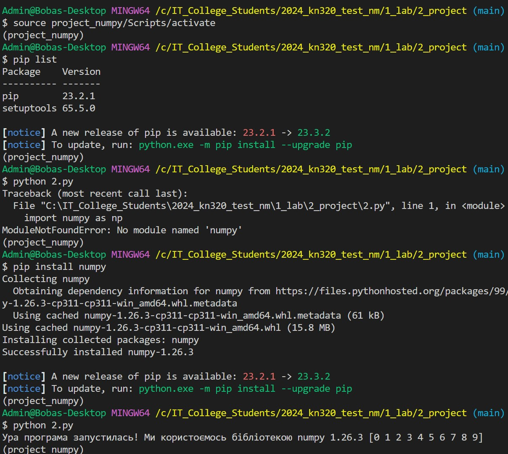
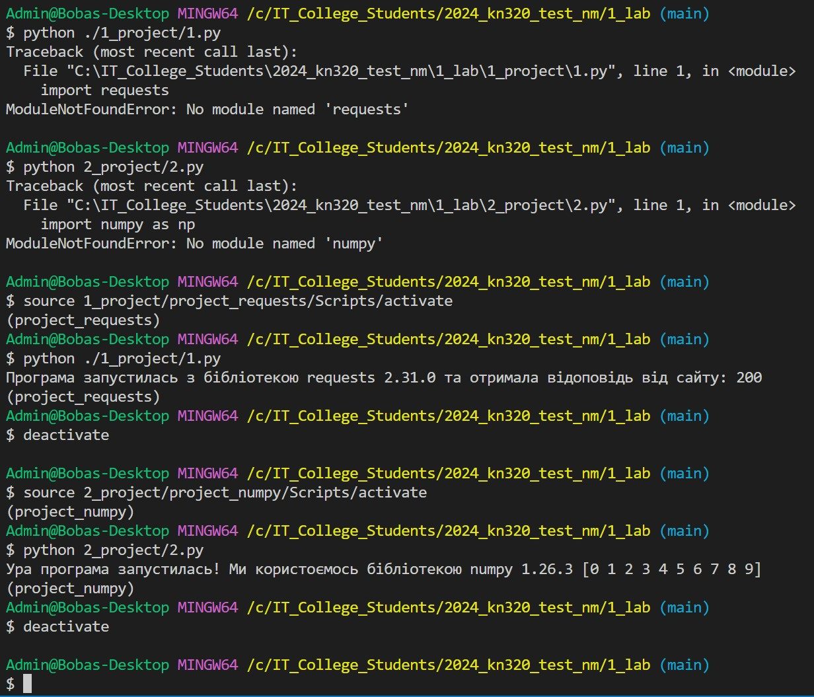
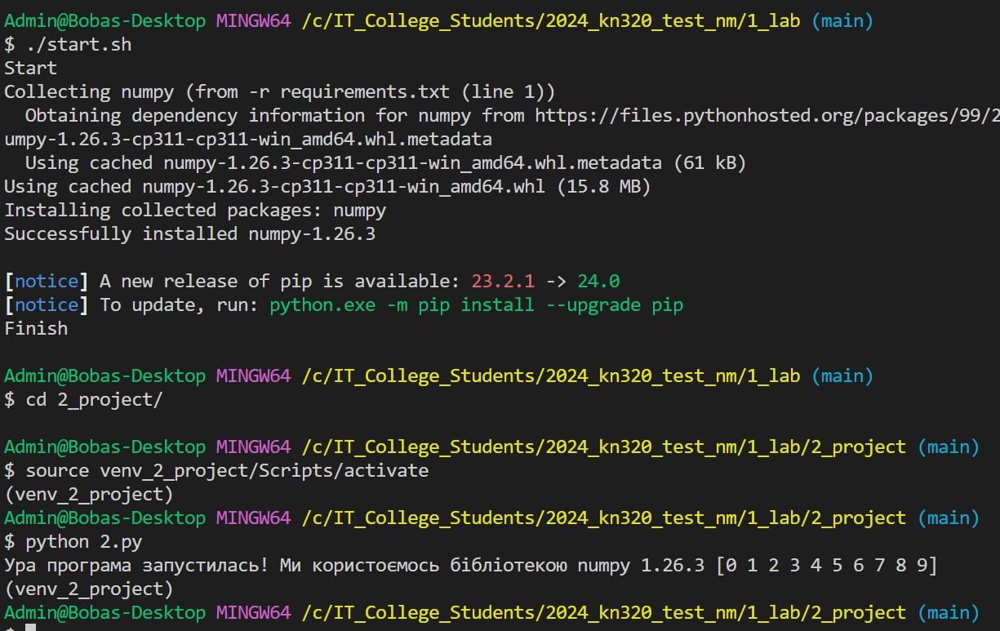
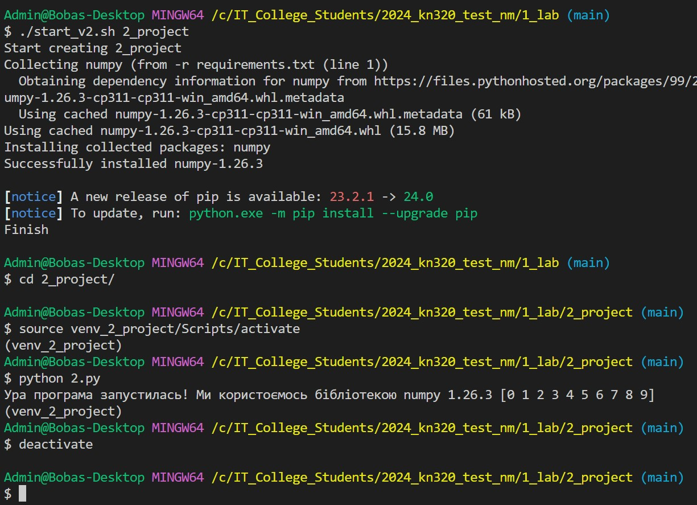
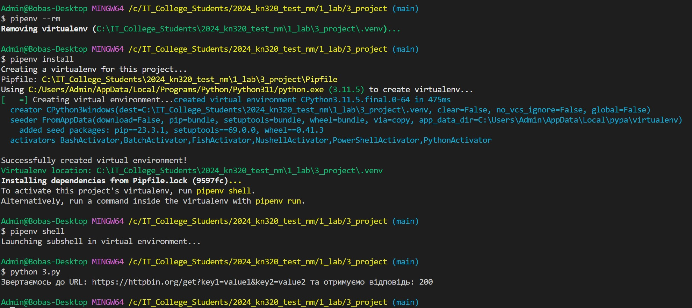

# Звіт до роботи
## Тема: _Робота у віртуальних середовищах Python_
### Мета роботи: _Навчитись створювати та працювати у віртуальних середовищах Python_

---
### Виконання роботи
* Результати виконання завдання:
    1. Розглянули що таке віртуальні середовища. Запитались у ChatGPT про пояснення:
        > `У мові програмування Python віртуальні середовища — це ізольовані області, де можна установлювати та використовувати певні версії бібліотек та пакетів. Вони дозволяють уникнути конфліктів між різними проектами, оскільки кожен проект може мати своє власне середовище зі своїми залежностями.`
    1. Спробували інсталювати пакети за допомогою утиліти pip, для цього виконали наступні команди у терміналі:
        ```bash
        pip install numpy
        pip show numpy
        ```
        - Результат виконання команд наступний
        
        - Після цього ми змогли виконати програму на Python
        
    1. Ми створили декілька проектів які будуть потребувати різних бібліотек, які не встановлені глобально. Тому програми не будуть виконуватись якщо у нас немає віртуальних середовищ.
    1. Будемо створювати віртуальні середовища за допомогою наступних команд:
        ```bash
        cd 1_lab/1_project/
        ls
        python -m venv ./project_requests
        cd ..
        cd 2_project/
        python -m venv ./project_numpy
        ```
        - результат виконання команд наступний
        
    1. Створили та активували проект з використання бібліотеки numpy:
        
    1. Також активували проект для requests:
        
    1. Робота з віртуальними середовищами тепер полягає у переключенні між ними, ми виконуємо активацію цих середовищ щоб мати змогу працювати з конкретним проектом. Приклад такої роботи нижче
        

    1. При копіюванні нашого репозиторію на новий ПК віртуальне середовище не буде присутнім і його потрібно кожен раз створювати. Для того щоб автоматизувати процес створення локального віртуального мередовища ми створимо Баш скрип який знаходиться у файлі [set-up](./1_project/set-up.sh).
        1. Для того щоб створити середовище та розпочати роботі нам потрібно:
            ```bash
            cd 1_project
            ./set-up.sh
            # Далі можемо працювати із середовищем
            source project_requests/Scripts/activate
            python 1.py
            deactivate
            ```
        1. Для середовища 2 ми використовували бульш загальний метод та помістили всі потрібні середовище бібліотеки у файл [requirements.txt](./2_project/requirements.txt) та написали новий скрипт [start.sh](./start.sh) який вже буде створювати середовище враховуючи даний файл. Для того щоб працювати у проекті 2 нам потрібно виконати наступні команди:
            ```bash
            ./start.sh
            # Після цього ми можемо починати працювати у середовищі
            cd 2_project
            source venv_2_project/Scripts/activate
            python 2.py
            deactivate
            ```
        1. Результат початку роботи у середовищі 2 представлено 
    1. Модифікуємо скрипт `start.sh` так щоб за допомогою нього можна було створювати локальні віртуальні середовища для різних проектів. Скрипт перепишемо та переназвемо наступним чином [start_v2.sh](./start_v2.sh).
        1. У проекті 1 ми достворили [requirements.txt](./1_project/requirements.txt) та вказали правильні бібліотеки.
        1. У [start_v2.sh](./start_v2.sh) ми зробили можливим передачу одного аргумента який буде відповідати за назву поточної папки проекту. Тому створення віртуального середовища буде відбуватись наступними командами:
            ```bash
            # Для проекту 1 буде
            ./start_v2.sh 1_project
            # Для проекту 2  буде
            ./start_v2.sh 2_project
            ```
        1. Результат створення проекту 2 за допомогою єдиного скрипта представлено на сріншоті 
    1. Пайтонівський шлях при роботі з менеджментом проектів та їх бібліотек може використовувати таку утиліту як `pipenv` (або її конкурент `poetry`). Ми її встановлюємо глобально та будемо використовувати для проекту 3.
        1. Викорнуємо наступні команди для початкового створення середовища :
            ```bash
            pip show pipenv # перевіряємо чи в нас є ця бібліотека та її версійність
            pip install pipenv --upgrade # інсталюємо пакет та у випадку якщо він вже є то здійснюємо його оновлення
            pipenv --help
            # оскільки утиліта працює, переходимо у потрібну папку та буде створювати проект
            cd 1_lab/3_project/
            # зробимо додаткову конфігурацію щоб наше середовище створювалось у тіт самій папці що і проект
            export PIPENV_VENV_IN_PROJECT=1
            pipenv --python 3.11 # Створюємо віртуальне середовище
            pipenv --venv # перевіряємо де було створене віртуальне середовище
            pipenv shell
            # Після того як завйшли в середовище інсталюємо пакети
            pipenv install requests
            pipenv install pytest --dev
            exit # дозволяє вийти з середовища
            ```
        1. Власне для початку роботи з вже налаштованим середовищем використовуємо наступні команди:
            ```bash
            pipenv --rm # видаляє середовище але не Pipfile
            # оскільки в нас є Pipfile ми завжди можемо відтворити наше віртуальне середовище
            pipenv install
            pipenv shell # Це активує середовище та зайде в нього, це те саме що і source .venv/Scripts/activate
            python 3.py
            exit
            ```
        1. Результат виконання команд, а саме активація середовища та виконання в ньому програм представлена на скріншоті 
    1. Змінні середовища дозволяють нам параметризувати наше серодовище передавши певні дані через пари `ключ=значення`. До прикладу створюємо такий файл у проекті 3, [.env](./3_project/.env), та вносимо змінну яка буде конфігурувати середовище pipenv щоб його файли створювались у поточні папці. А також додамо декілька змінних які спробуємо вичитати власне у Python програмі. Результат роботи наступний 
    1. Запитались у ChatGPT як сторити проект та написати мінімальний веб-сайт. Його відповідь наступна:

        ---

        ### Відповідь ChatGPT

        Ось кроки для створення проекту на Python з         використанням бібліотеки pipenv для реалізації      простого веб-сайту на Flask з двома сторінками, index       та help:

        **Крок 1: Встановлення pipenv**
        ```bash
        pip install pipenv
        ```

        **Крок 2: Створення папки для проекту та перехід у      неї**
        ```bash
        mkdir my_flask_project 
        cd my_flask_project
        # Назву ми задали по іншому
        cd 4_project/
        ```

        **Крок 3: Ініціалізація середовища pipenv**
        ```bash
        pipenv --three # Цей крок не правильний, ми         використали наступну команд
        pipenv --python 3.11
        ```

        **Крок 4: Встановлення Flask**
        ```bash
        pipenv install flask
        ```

        **Крок 5: Створення файлу з кодом Flask**
        Створіть файл з назвою app.py та додайте наступний      код:

        ```python
        from flask import Flask

        app = Flask(__name__)

        @app.route('/')
        def index():
            return 'Welcome to the index page!'

        @app.route('/help')
        def help():
            return 'Welcome to the help page!'

        if __name__ == '__main__':
            app.run(debug=True)
        ```

        **Крок 6: Запуск веб-сервера**
        ```bash
        pipenv run python app.py
        ```

        Тепер ваш простий веб-сайт на Flask з двома         сторінками, index та help, повинен бути доступним за        адресою http://127.0.0.1:5000/.

        ---

        1. Запуск програми є наступним 
        2. Робота веб сайту у браузері наступна 


---
### Висновок:
> у висновку потрібно відповісти на запитання:

- :question: Що зроблено в роботі;
- :question: Чи досягнуто мети роботи;
- :question: Які нові знання отримано;
- :question: Чи вдалось відповісти на всі питання задані в ході роботи;
- :question: Чи вдалося виконати всі завдання;
- :question: Чи виникли складності у виконанні завдання;
- :question: Чи подобається такий формат здачі роботи (Feedback);
- :question: Побажання для покращення (Suggestions);

---
